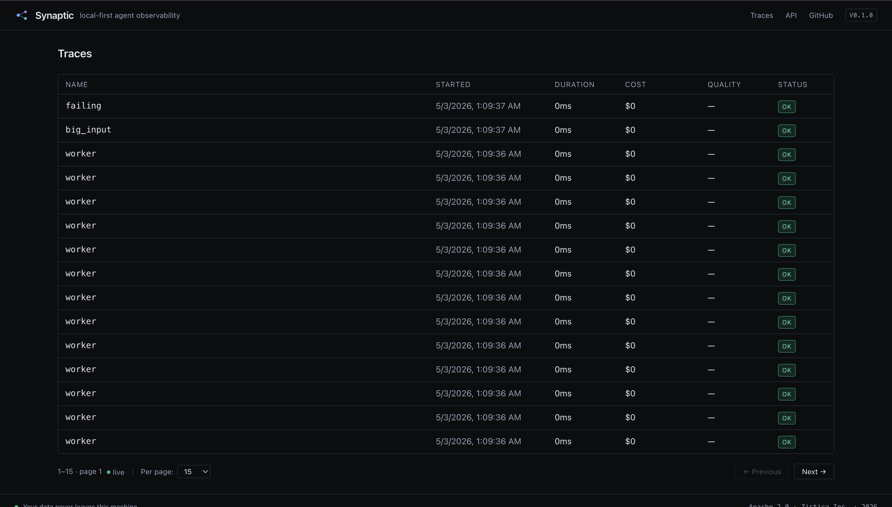
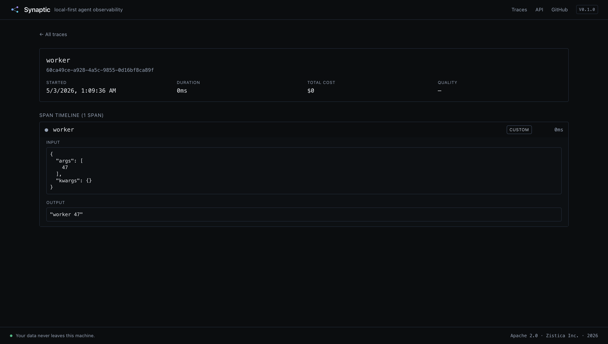

# Synaptic

> Local-first AI agent observability. Runs on your laptop. No account. No data leaves your machine.

[](https://github.com/amitbidlan/zistica-synaptic/actions/workflows/ci.yml)
[](LICENSE)
[](https://www.python.org)
[](https://nodejs.org)

You build an AI agent. It works in testing. You deploy it. A user complains it gave a wrong answer. You have no idea why — which step failed, what data it used, where it went wrong.

Synaptic is a CCTV camera for your AI agent. Add 2 lines of code. Every decision, every tool call, every LLM response — recorded, visible, debuggable.

---

## Quick start

```bash
git clone https://github.com/amitbidlan/zistica-synaptic
cd zistica-synaptic
docker build -t synaptic .
docker run -p 3000:3000 -p 8000:8000 -v $(pwd)/data:/data synaptic
```

Open <http://localhost:3000> — the dashboard is ready.

Then in your agent:

```python
import synaptic

@synaptic.trace
def my_agent(question: str) -> str:
    docs = search_documents(question)
    return gpt4_answer(question, docs)

my_agent("What is the capital of France?")
# Trace appears in the dashboard.
```

That's it. No account, no API key, no data leaves your laptop.

---

## Preview



*Trace list — every agent run on a paginated, live-refreshing table.*



*Trace detail — click any span in the timeline to inspect its input/output JSON. Errors render in red.*

---

## What you get

- **Span timeline** — every LLM call, tool invocation, retrieval, and custom span rendered as an indented tree, click any span to expand its input/output JSON
- **Cost & token tracking** — automatic per-call breakdown for OpenAI and Anthropic model families
- **Quality scoring** — bring-your-own evals via `POST /v1/evals`
- **Framework integrations** — drop-in support for [LangChain](#langchain) (zero-config via `SYNAPTIC_TRACING=true`) and [CrewAI](#crewai) (one-line `instrument_crew()`)
- **Cross-language SDKs** — Python and TypeScript with identical wire format and behavior
- **Resilient by design** — the agent never fails because Synaptic is down. Spans drop silently if the queue overflows, the exporter is unreachable, or the server returns an error
- **Local-first** — single Docker image, DuckDB + SQLite, no external services, no cloud dependency
- **90-day retention** — automatic cleanup task keeps the database from growing unbounded (configurable via env var)

---

## Architecture

```
   Agent code (Python or TypeScript)
        │  @synaptic.trace / trace(fn)
        ▼
   SDK queue (bounded, drop-on-overflow)
        │  background async exporter
        ▼
   HTTP POST /v1/spans  ───►  FastAPI
                                 │
                                 ▼
                              DuckDB (traces, spans, evals)
                              SQLite (metadata)
                                 ▲
                                 │  GET /v1/traces
   Browser  ──►  Next.js Dashboard ──►  /api/* (rewrite proxy)
                  localhost:3000          same-origin
```

Single Docker container runs the API on `:8000` and the Next.js standalone dashboard on `:3000`. The dashboard's `/api/*` rewrite proxies to the API so the browser never crosses origins (no CORS to configure).

---

## Packages

| Path | Package | Tests |
|---|---|---|
| [`packages/sdk-python/`](packages/sdk-python/) | Python SDK with `@synaptic.trace`, `synaptic.span()`, integrations | 56 |
| [`packages/sdk-typescript/`](packages/sdk-typescript/) | `@synaptic/sdk` — peer of the Python SDK | 31 |
| [`packages/api/`](packages/api/) | FastAPI ingest + query API, DuckDB storage | 29 |
| [`packages/dashboard/`](packages/dashboard/) | Next.js 14 dashboard with paginated timeline | build clean |

---

## Install

### Python SDK

```bash
pip install -e packages/sdk-python              # core only
pip install -e packages/sdk-python[langchain]   # + LangChain integration
pip install -e packages/sdk-python[crewai]      # + CrewAI integration
pip install -e packages/sdk-python[all]         # both integrations
```

### TypeScript SDK

```bash
# Build the SDK locally (it's not yet published to npm):
cd packages/sdk-typescript && npm install && npm run build

# Then in your project, link or install from the path:
npm install /absolute/path/to/zistica-synaptic/packages/sdk-typescript
```

### Whole stack via Docker

Already covered in [Quick start](#quick-start). One image, both API and dashboard.

---

## Usage

### Python — decorator

```python
import synaptic

synaptic.configure(host="http://localhost:8000")  # or set SYNAPTIC_HOST

@synaptic.trace
def my_agent(input: str) -> str:
    return "hello"

my_agent("test")  # trace appears in the dashboard
```

### Python — context manager (manual span)

```python
with synaptic.span("retrieval", type="retrieval") as s:
    results = vector_db.search(query)
    s.set_output({"count": len(results)})
```

### TypeScript

```typescript
import { configure, trace } from '@synaptic/sdk';

configure({ host: 'http://localhost:8000' });

const myAgent = trace(async (input: string) => {
  return 'hello';
}, { name: 'my_agent' });

await myAgent('test');
```

### LangChain

Zero-config — set the env var before importing LangChain and every chain is auto-traced:

```python
import os
os.environ["SYNAPTIC_HOST"] = "http://localhost:8000"
os.environ["SYNAPTIC_TRACING"] = "true"

from langchain_openai import ChatOpenAI
ChatOpenAI().invoke("Hello")  # span recorded with model, tokens, cost
```

Or attach the handler explicitly:

```python
from synaptic.integrations.langchain import SynapticCallbackHandler

handler = SynapticCallbackHandler()
llm = ChatOpenAI(callbacks=[handler])
```

### CrewAI

```python
from synaptic.integrations.crewai import instrument_crew
instrument_crew()

from crewai import Agent, Task, Crew
crew = Crew(agents=[...], tasks=[...])
crew.kickoff()
# crew.kickoff -> root span
# each agent.execute_task -> child span
# LLM calls inside agents -> grandchildren (via the LangChain integration)
```

---

## Configuration

| Env var | Default | Effect |
|---|---|---|
| `SYNAPTIC_HOST` | `http://localhost:8000` | API endpoint the SDK posts to |
| `SYNAPTIC_API_KEY` | _(none)_ | Sent as `X-API-Key` header |
| `SYNAPTIC_PROJECT` | `default` | Project identifier |
| `SYNAPTIC_TRACING` | _(unset)_ | Set to `true` to auto-attach the LangChain handler |
| `SYNAPTIC_DATA_DIR` | `./data` (or `/data` in Docker) | Where DuckDB + SQLite files live |
| `SYNAPTIC_RETENTION_DAYS` | `90` | Max age of traces before automatic cleanup |
| `SYNAPTIC_CLEANUP_INTERVAL_HOURS` | `24` | How often the cleanup task sweeps |
| `SYNAPTIC_CLEANUP_ENABLED` | `true` | Set to `false` to disable retention cleanup |

---

## Development

```bash
# Python SDK
cd packages/sdk-python
python -m venv .venv && .venv/bin/pip install -e ".[test,langchain]"
.venv/bin/pytest

# FastAPI
cd packages/api
python -m venv .venv && .venv/bin/pip install -r requirements.txt pytest httpx
.venv/bin/pytest

# TypeScript SDK
cd packages/sdk-typescript
npm install && npm run build && npm test

# Dashboard
cd packages/dashboard
npm install && npm run dev   # http://localhost:3000
```

CI runs the full matrix (Python SDK, API, TypeScript SDK, dashboard build, Docker image smoke test) on every push and pull request — see [`.github/workflows/ci.yml`](.github/workflows/ci.yml).

---

## API reference (selected)

```
POST   /v1/spans              # SDKs send here
POST   /v1/traces             # Manual upsert
GET    /v1/traces             # Paginated list (?limit=&offset=)
GET    /v1/traces/{id}        # Single trace
GET    /v1/traces/{id}/spans  # All spans for a trace
POST   /v1/evals              # Submit a quality score
GET    /health                # Liveness check
GET    /docs                  # Auto-generated OpenAPI UI
```

---

## License

[Apache License 2.0](LICENSE) — free to use, fork, modify, and distribute.

---

## Community

- **Code of Conduct** — see [CODE_OF_CONDUCT.md](CODE_OF_CONDUCT.md). Reports to `support@zistica.com`.
- **Security** — see [SECURITY.md](SECURITY.md). Please report vulnerabilities privately.
- **Contributing** — see [CONTRIBUTING.md](CONTRIBUTING.md). Good first issues are labeled in the [tracker](https://github.com/amitbidlan/zistica-synaptic/issues).
